# Instructions for FAIRmat PI onboarding

This page provides instructions for completing the onboarding form in the [FAIRmat Outreach NOMAD Oasis](https://fairmat-oasis.physik.hu-berlin.de/nomad-oasis) deployment. The collected information helps FAIRmat understand your research activities, data workflows, current research data management practices, and potential integration points with NOMAD services and infrastructure.

## Create a NOMAD user account

A NOMAD user account is required to access and use NOMAD services, including data management, collaboration, publishing, and analysis features across the NOMAD ecosystem. Publicly available data on NOMAD can be explored without an account. Creating an account is free and only takes a few minutes.

If you already have a NOMAD account, you can use the same account credentials to access the Outreach NOMAD Oasis. There is no need to create a separate account.

!!! warning "Attention"
    Access to the Outreach NOMAD Oasis is restricted to authorized users. The official email addresses of FAIRmat PIs have already been whitelisted. If you create your NOMAD account using your official FAIRmat email address, you should be able to access the onboarding Oasis without additional steps.

    If you have questions about which email address has been whitelisted, experience access issues, or would like to use a different email address, please [contact the FAIRmat team](mailto:fairmat@physik.hu-berlin.de).

**Use the arrow buttons ⬅️➡️ below to slide through the steps and create a NOMAD account.**

    
←

    
    
    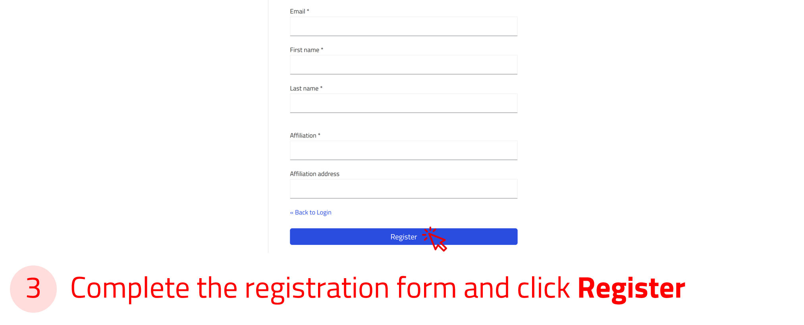
    
    
→

!!! tip "Login via Helmholtz AAI"
    You can also sign in to NOMAD using your university or research institute credentials, or with social accounts such as GitHub, ORCID, or Google through the Helmholtz AAI.
    For more information, see [NOMAD documentation](https://nomad-lab.eu/prod/v1/docs/tutorial/overview.html#login-options-via-helmholtz-aai){:target="_blank" rel="noopener"}

---

## Create new upload

In NOMAD, uploads are used to organize and manage related files and entries. During the FAIRmat PI onboarding process, you will create an upload that contains your onboarding form and related information.

For more information about NOMAD uploads and entries, see [The key elements in NOMAD](https://fairmat-nfdi.github.io/nomad-docs/tutorial/upload_publish.html#the-key-elements-in-nomad){:target="_blank" rel="noopener"}

The uploads exist in the *Your uploads* page. Here you can view a list of all your uploads with their relevant information. You can also create new uploads or add an example upload prepared by others.

**Use the arrow buttons ⬅️➡️ below to follow the steps for creating your first upload.**

    
←

    
    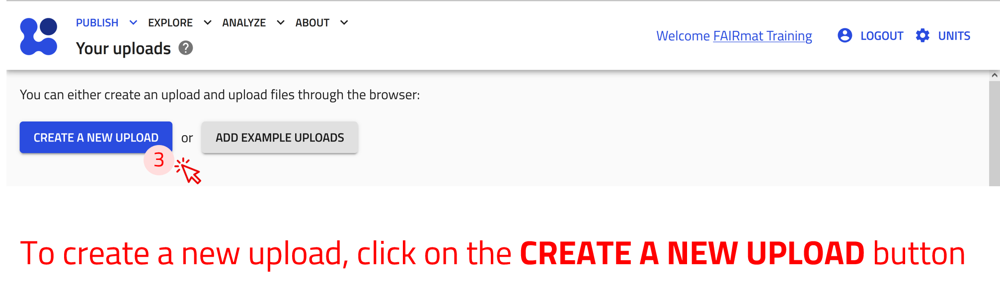
    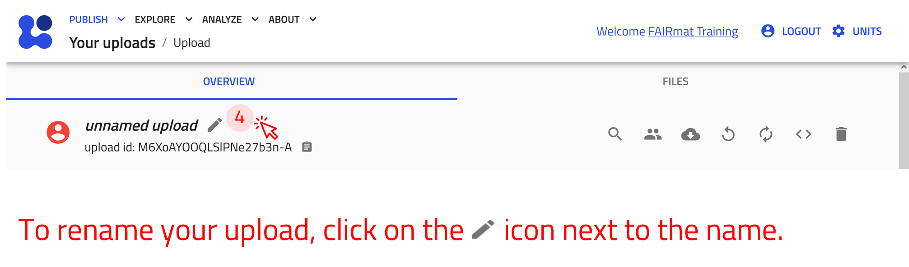
    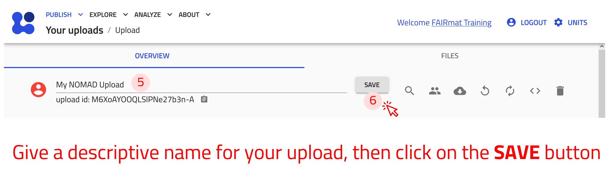
    
→

---

## Share your upload

Uploads in NOMAD act as collaborative workspaces where data, metadata, and workflows can be organized, shared, and managed.

Uploads can be shared with individual users or user groups using different permission roles:

- Co-authors can edit and manage the upload content.
- Reviewers can access and review the upload without modifying its content.

For the FAIRmat PI onboarding process, you will add the onboarding team group as co-author so that the FAIRmat team can access and curate your onboarding information.

**Use the arrow buttons ⬅️➡️ below to follow the steps for creating your first upload.**

    
←

    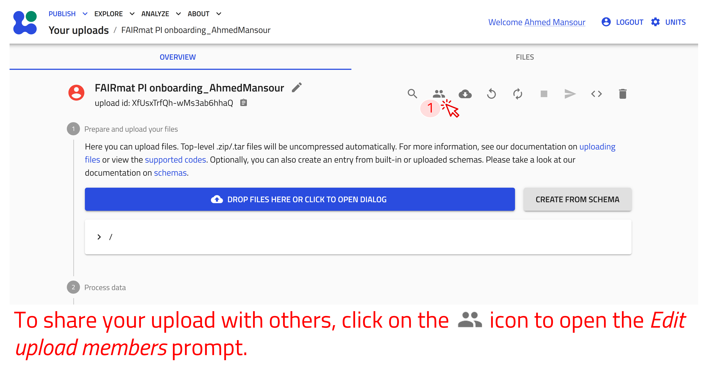
    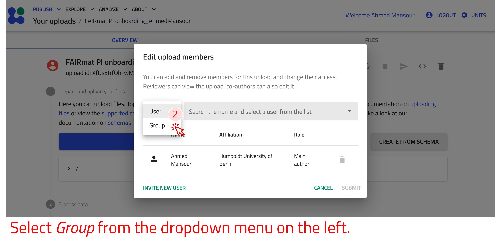
    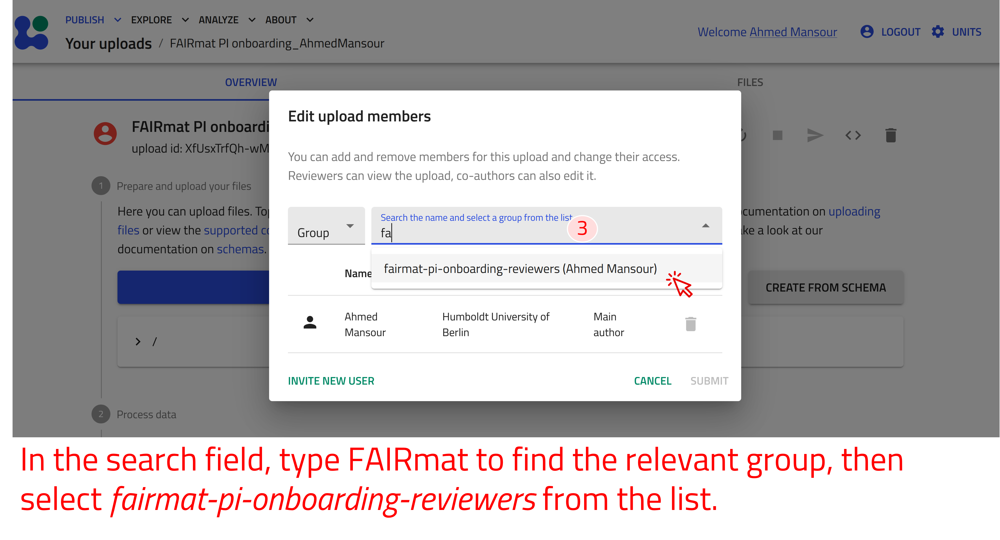
    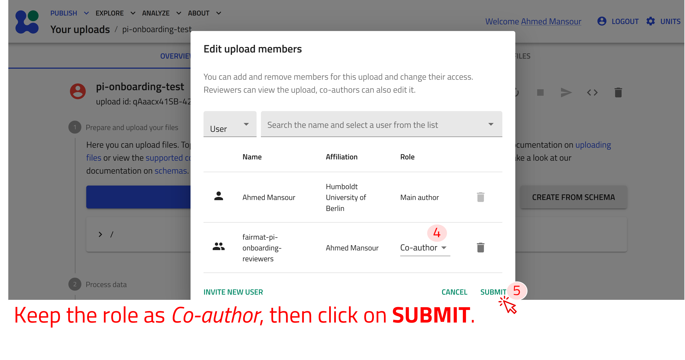
    
→

---

## Create an onboarding form entry

The FAIRmat PI onboarding form is provided as an ELN entry within NOMAD.
NOMAD ELN entries provide structured, form-based interfaces for collecting and managing metadata and research information.

For more information about NOMAD uploads and entries, see [The key elements in NOMAD](https://fairmat-nfdi.github.io/nomad-docs/tutorial/upload_publish.html#the-key-elements-in-nomad){:target="_blank" rel="noopener"}

In this step, you will create a new entry based on the FAIRmat PI onboarding schema.

**Use the arrow buttons ⬅️➡️ below to follow the steps for creating ELN entries using the built-in schema.**

    
←

    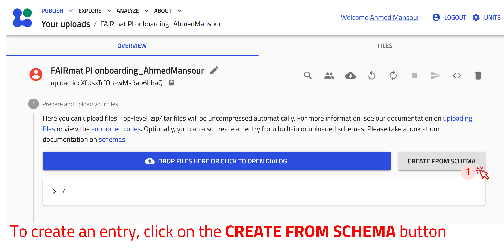
    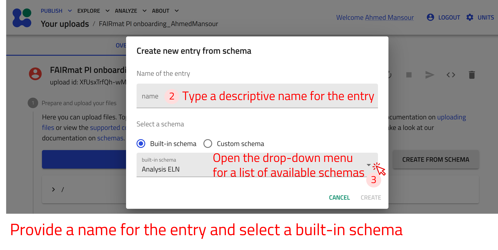
    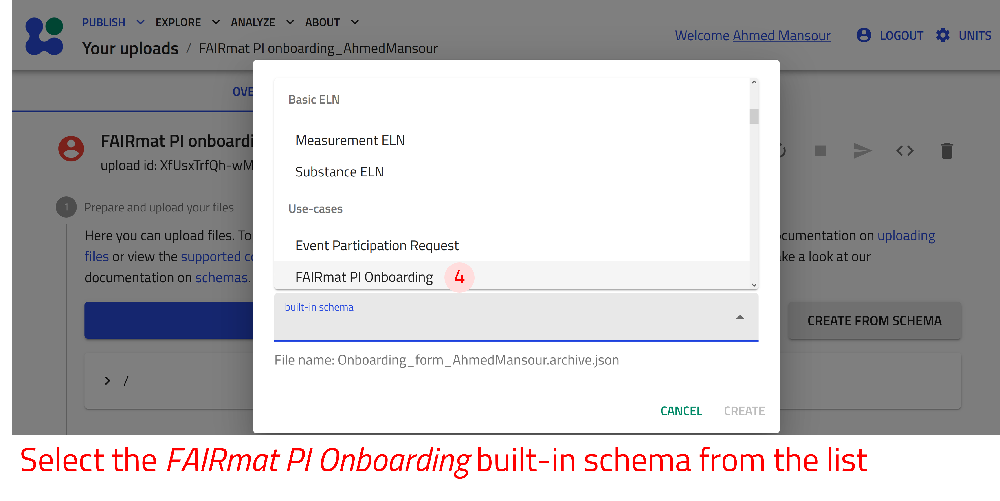
    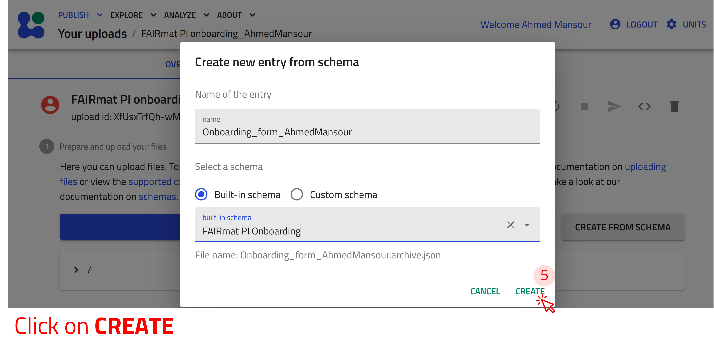
    
→

---

## Fill in the onboarding form

The FAIRmat PI onboarding form is provided as a NOMAD ELN entry. NOMAD ELN entries provide structured, form-based interfaces for collecting and managing metadata and research information.

Start by completing the general information section at the top of the form. The form then contains four main subsections:

1. **Research Focus**
   General information about your research activities, scientific scope, methods, and workflows.

2. **Research Data Management**
   Information about research data, metadata practices, storage solutions, standards, and data-management workflows. This subsection includes another repeatable subsection called **research data** which allows providing information for the various research data types generated in your group.

3. **NOMAD Usage**
   Information about current or planned usage of services, training needs, and workflow integration interests.

4. **Onboarding administration**
   Internal section for the FAIRmat onboarding team. Please do not edit this section.

!!! tip "NOMAD subsections"
    In NOMAD, subsections are reusable sections inside an entry that help organize related information in a structured way. Some subsections can be repeated multiple times, allowing you to add several entries of the same type, for example different research-data types or workflows.

**Adding subsections**

Available subsections appear at the bottom of the form. To create a subsection use the following steps.

**Use the arrow buttons ⬅️➡️ below to follow the steps for creating ELN entries using the built-in schema.**

    
←

    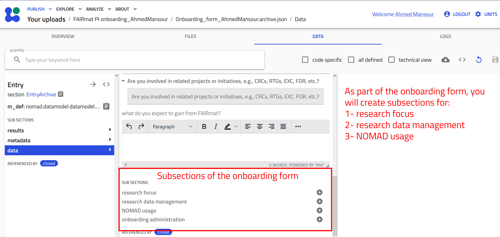
    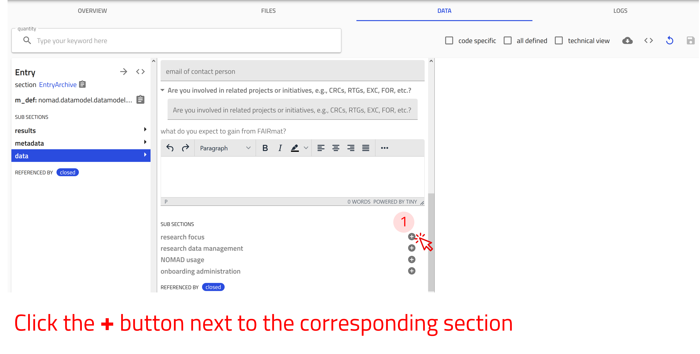
    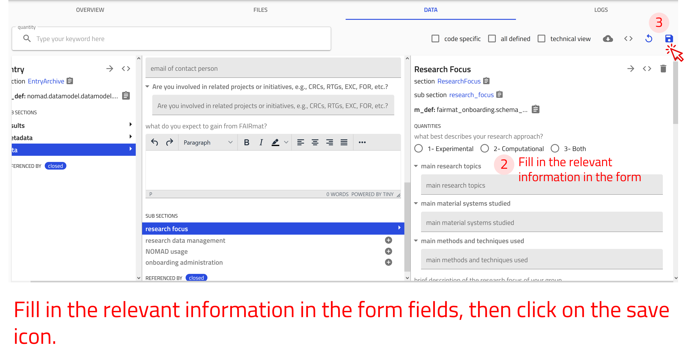
    
→

---

For a detailed description of the form fields and sections, as well as , see [Reference > FAIRmat PI onboarding form](../reference/references.md).